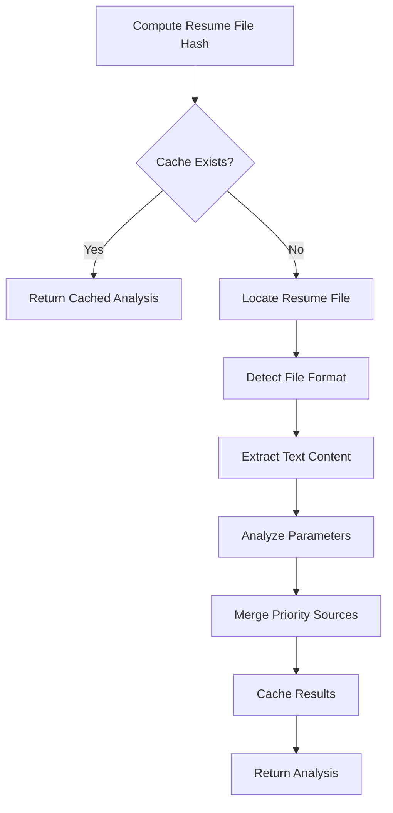

# Resume Analysis for Job Search Parameters

Analyze candidate resume and extract comprehensive job search parameters for LinkedIn automation.

**Instructions:** 
Parse resume file and extract optimal job search parameters: $ARGUMENTS

**Default Parameters:**
- **Resume Source**: Check arguments → .env file → default location
- **Target Count**: 100 applications (if not specified)
- **Cache Strategy**: Use file hash-based caching to avoid re-analysis

**Parameter Extraction:**
The system will analyze the resume to determine:
- **Personal Info**: Name, contact details, current location, work authorization
- **Job Titles**: Current/target roles based on experience and progression
- **Skills**: Technical expertise and domain knowledge for keyword matching
- **Seniority**: Experience level for appropriate role targeting
- **Location Preferences**: Current location and relocation willingness
- **Industry Focus**: Previous companies/sectors for targeted search

**Priority System:**
1. **Explicit Parameters** (provided in arguments) - Highest priority
2. **Resume Extraction** (analyzed from resume content) - Medium priority  
3. **Intelligent Defaults** (system fallbacks) - Lowest priority

**Cache Management:**
- **Cache Location**: `.claude/cache/` directory with SHA256 hash filenames
- **Cache Check**: Compute file hash and check for existing analysis
- **Cache Hit**: Return cached results immediately for unchanged resumes
- **Cache Miss**: Perform full analysis and cache results for future use

**Example Usage:**
- `/analyze-resume` (uses .env resume path and intelligent defaults)
- `/analyze-resume --resume /path/to/resume.pdf --target-count 50`
- `/analyze-resume --keywords "AI ML" --location "Seattle" --overqualified allow`
- `/analyze-resume --resume resume.pdf --job-titles "Principal Engineer,Staff Engineer"`

**Multi-Step Process:**



**Analysis Output:**
- **Candidate Profile**: Name, contact info, location, work status
- **Job Search Config**: Keywords, titles, location preferences, seniority
- **Technical Skills**: Programming languages, frameworks, tools
- **Industry Context**: Company types, sectors, role progression
- **Application Strategy**: Target count, time preferences, overqualified policy

**Parameter Validation:**
- Email format and contact information verification
- Location parsing and geographic validation
- Skill categorization and relevance scoring
- Experience level assessment and seniority mapping

**Resume Format Support:**
- **PDF**: Text extraction via parsing libraries
- **DOC/DOCX**: Microsoft Word document processing
- **Markdown**: Direct text processing with structure parsing
- **TXT**: Plain text analysis with pattern recognition

**Error Handling:**
- Graceful degradation for missing or incomplete resume sections
- Intelligent defaults when specific parameters cannot be extracted
- Format detection fallbacks for unusual file types
- User guidance for manual parameter specification when auto-extraction fails

**Context Output:**
Provides structured candidate profile and search parameters ready for use by LinkedIn automation workflow (login → search → application → tracking).

## Implementation

**Step 1: Resume File Resolution**
```bash
# Check arguments for resume path
# Fall back to .env RESUME_PATH
# Use default locations as final fallback
```

**Step 2: Cache Management**  
```bash
# Compute SHA256 hash of resume file using shasum (cross-platform)
shasum -a 256 resume_file | cut -d' ' -f1
# Check .claude/cache/{hash}.md for existing analysis
# Return cached results if found and valid
```

**Step 3: Content Extraction**
```bash
# Detect file format (PDF, DOC, MD, TXT)
# Extract text content using appropriate method
# Handle encoding and formatting issues
```

**Step 4: Parameter Analysis**
```bash
# Parse contact information (name, email, phone, location)
# Extract job titles and career progression
# Identify technical skills and expertise areas
# Determine experience level and seniority
```

**Step 5: Intelligent Merging**
```bash
# Apply priority system: arguments > resume > defaults
# Validate and normalize extracted parameters
# Fill gaps with intelligent defaults
# Ensure completeness for automation workflow
```

**Step 6: Result Caching**
```bash
# Write analysis results to cache file
# Include timestamp and resume hash for validation
# Structure output for easy consumption by automation
```

Execute comprehensive resume analysis with intelligent parameter extraction and caching.