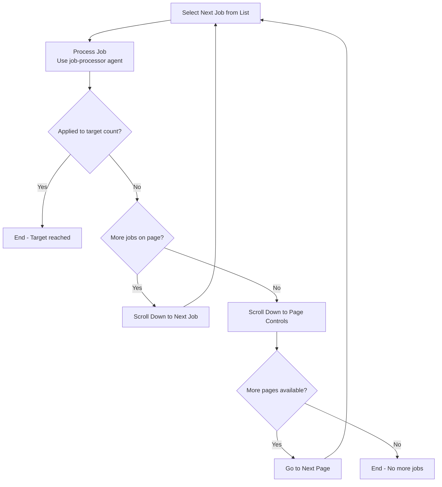

# Browse and Apply to Jobs

Browse through LinkedIn job search results and apply to positions that match candidate criteria.

**Instructions:** 
Parse the following free-text instructions to extract application parameters: $ARGUMENTS

**Default Parameters (if not specified in instructions):**
- Target Count: 100 applications
- Application Method: Easy Apply preferred
- Quality Filter: Match candidate profile and experience

**Example Usage:**
- `/browse-apply-jobs` (uses defaults - apply to 100 suitable jobs)
- `/browse-apply-jobs Apply to 20 jobs that match my background`
- `/browse-apply-jobs Find 50 suitable positions and apply using Easy Apply only`
- `/browse-apply-jobs Apply to relevant Senior Engineer roles, target 30 applications`

**Smart Defaults Example:**
For a candidate with Principal Software Engineer background in AI/ML, the system would apply to relevant Principal/Staff/Senior engineering positions that match technical expertise and experience level. If user requests including overqualified roles, it would also apply to mid-level and entry-level positions.

**Automation Process Flow:**

**Key Features:**
- Uses Playwright MCP server exclusively for all browser interactions
- Human-like interaction patterns (delays, natural scrolling)
- Error handling and retry mechanisms

## Task Execution Rules

**SEQUENTIAL EXECUTION REQUIRED** - All Task tool calls must run sequentially:

1. **Job Processing** (one job at a time using job-processor agent)
2. **Application Tracking** (after each application to check count)

**Never run Task tool calls in parallel** - Each job must be completely processed before moving to the next job.

## Context Passing Requirements

**CRITICAL:** Pass complete context to all Task tool calls to ensure proper job processing:

1. **Job Processing Task** (job-processor agent) - Pass:
   - Complete candidate profile (skills, experience, preferences)
   - Target application count and current progress  
   - Application preferences (Easy Apply preference, salary requirements, overqualified policy)
   - Resume file path for upload during applications
   - User instructions regarding overqualified positions (from original command arguments)

2. **Application Tracking Task** (application-tracker agent) - Pass:
   - Target application count for goal comparison
   - Current session start time for daily tracking
   - Search context (keywords, filters used) for logging context

**Error Handling & Diagnostics:**
- **System Errors**: Invoke diagnostic-fix-agent for Playwright MCP failures, browser pagination errors, or job-processor agent crashes
- **Workflow Failures**: Use diagnostic-fix-agent when job selection logic fails repeatedly, application workflow breaks, or tracking system malfunctions
- **Unexpected Behavior**: Call diagnostic-fix-agent for LinkedIn interface changes that break job browsing, application form errors, or context passing failures

Execute the browse and apply workflow for job opportunities.