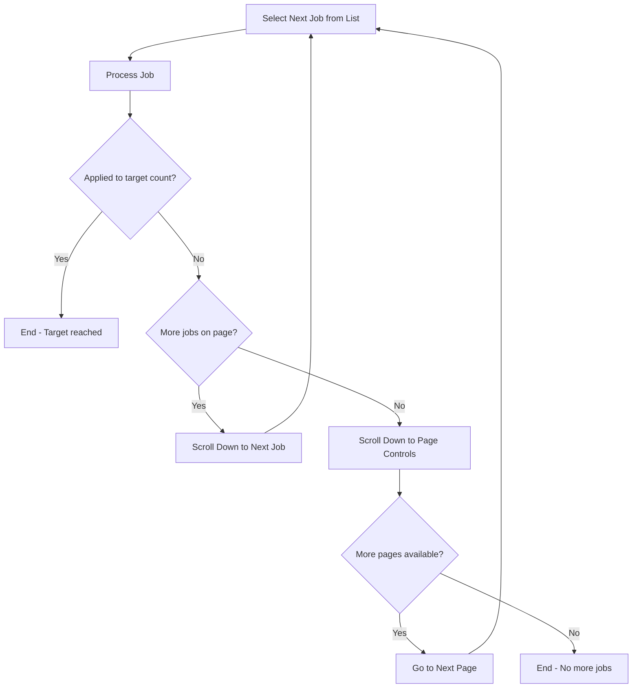

# Browse and Apply to Jobs

Browse through LinkedIn job search results and apply to positions that match candidate criteria.

**Instructions:** 
Parse the following free-text instructions to extract application parameters: $ARGUMENTS

**Default Parameters (if not specified in instructions):**
- Target Count: 100 applications
- Application Method: Easy Apply preferred
- Quality Filter: Match candidate profile and experience

**Example Usage:**
- `/browse-apply-jobs` (uses defaults - apply to 100 suitable jobs)
- `/browse-apply-jobs Apply to 20 jobs that match my background`
- `/browse-apply-jobs Find 50 suitable positions and apply using Easy Apply only`
- `/browse-apply-jobs Apply to relevant Senior Engineer roles, target 30 applications`

**Smart Defaults Example:**
For a candidate with Principal Software Engineer background in AI/ML, the system would apply to relevant Principal/Staff/Senior engineering positions that match technical expertise and experience level.

**Automation Process Flow:**

**Key Features:**
- Uses Playwright MCP server exclusively for all browser interactions
- Human-like interaction patterns (delays, natural scrolling)
- Error handling and retry mechanisms

Execute the browse and apply workflow for job opportunities.