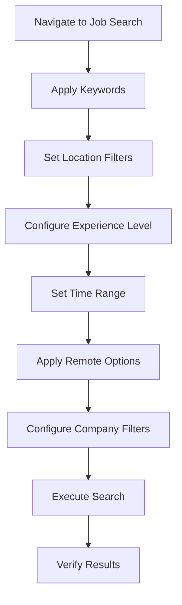

# LinkedIn Job Search Configuration

Configure LinkedIn job search with intelligent filters and parameters using browser automation.

**Instructions:** 
Setup LinkedIn job search with specified parameters: $ARGUMENTS

**Default Parameters:**
- **Keywords**: From resume analysis (job titles, skills, technologies)
- **Location**: From resume analysis (current location + remote options)
- **Experience Level**: Matched to candidate seniority
- **Time Filter**: "Past week" (configurable)
- **Remote Work**: Include remote and hybrid options

**Search Configuration:**
The system will:
- **Navigate**: Go to LinkedIn job search page
- **Keywords**: Apply job titles and technical skills as search terms
- **Location Filters**: Set geographic preferences and remote options
- **Experience Filters**: Configure seniority level targeting
- **Company Filters**: Apply industry and company size preferences
- **Time Filters**: Set job posting date range

**Parameter Sources:**
1. **Command Arguments** - Direct search specification (highest priority)
2. **Resume Analysis** - Extracted from candidate profile (medium priority)
3. **Intelligent Defaults** - System fallbacks for missing parameters (lowest priority)

**Search Strategy:**
- **Broad Initial Search**: Start with primary keywords and location
- **Progressive Refinement**: Add filters to narrow results to target range
- **Skill Matching**: Include technical skills for precise role targeting
- **Location Optimization**: Balance local and remote opportunities

**Example Usage:**
- `/linkedin-job-search` (uses resume-extracted parameters)
- `/linkedin-job-search --keywords "Principal Engineer AI ML" --location "Seattle"`
- `/linkedin-job-search --remote-only --experience senior --time "past 3 days"`
- `/linkedin-job-search --companies "Google,Microsoft,Amazon" --salary 200000`

**Multi-Step Search Configuration:**

**Search Parameters:**
- **Keywords**: Job titles, technical skills, domain expertise
- **Location**: Geographic areas, remote work options, relocation preferences
- **Experience**: Entry, Associate, Mid, Senior, Director, VP, Executive levels
- **Company**: Industry sectors, company sizes, specific organizations
- **Salary**: Compensation ranges and equity considerations
- **Job Type**: Full-time, part-time, contract, temporary positions

**Filter Application:**
- **Dynamic Interface**: Adapt to LinkedIn's current search interface
- **Element Detection**: Robust identification of search and filter controls
- **Progressive Enhancement**: Apply filters incrementally with validation
- **Error Recovery**: Fallback strategies for interface changes

**Search Optimization:**
- **Result Volume**: Target optimal number of results (not too few, not overwhelming)
- **Relevance Scoring**: Prioritize highly relevant opportunities
- **Diversity**: Include range of companies, roles, and compensation levels
- **Freshness**: Focus on recently posted positions for better response rates

**Browser State Management:**
- **Session Maintenance**: Keep authenticated session active
- **Navigation Stability**: Handle page loads and dynamic content
- **Search State**: Preserve applied filters and search context
- **Result Pagination**: Prepare for multi-page result browsing

**Verification Steps:**
After search configuration:
- Confirm search parameters applied correctly
- Verify reasonable number of results returned  
- Check result relevance and quality
- Ensure browser ready for job browsing workflow

**Output Context:**
Provides configured search state and result metrics for job application workflow.

## Implementation

**Step 1: Navigation Setup**
- Navigate to LinkedIn job search page from authenticated session
- Verify page load and search interface availability
- Identify search input fields and filter controls
- Prepare for parameter application

**Step 2: Keyword Application**
- Extract primary keywords from resume analysis or arguments
- Apply job titles and technical skills to search input
- Execute initial search to establish baseline results
- Monitor search execution and result loading

**Step 3: Location Configuration**
- Parse location preferences from candidate profile
- Apply geographic filters (city, state, country)
- Configure remote work and hybrid options
- Set relocation and commute preferences

**Step 4: Experience Level Setting**
- Map candidate seniority to LinkedIn experience levels
- Apply appropriate experience filters
- Consider career progression and target roles
- Balance current level with growth opportunities

**Step 5: Advanced Filtering**
- Apply company type and size preferences
- Set salary and compensation filters when specified
- Configure job type and work arrangement options
- Apply time range for job posting freshness

**Step 6: Search Execution and Verification**
- Execute final search with all parameters applied
- Verify result count and relevance
- Check for search errors or filter conflicts
- Prepare browser state for job browsing workflow

Execute comprehensive LinkedIn job search configuration with intelligent parameter application.