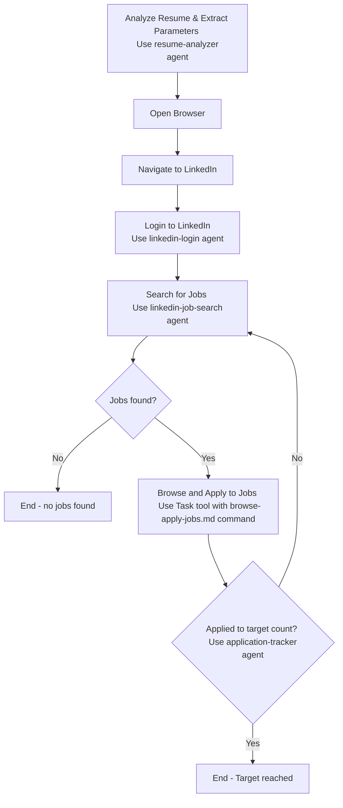

# LinkedIn Job Application Automation

Perform comprehensive LinkedIn job search and application automation with the following parameters:

**Instructions:** 
Parse the following free-text instructions to extract search parameters: $ARGUMENTS

**Default Parameters (if not specified in instructions):**
- Keywords: Extracted from candidate's resume (job titles, skills, seniority level)
- Location: Extracted from candidate's resume (current location, willing to relocate)
- Time Filter: "Past week"
- Target Count: 100 applications

**Resume Analysis:**
The system will automatically analyze the candidate's resume to determine:
- **Job Titles**: Current/target roles (e.g., "Principal Software Engineer", "Staff Engineer")
- **Skills**: Technical expertise for keyword matching (e.g., "AI/ML", "Cloud", "Python")
- **Seniority**: Experience level for appropriate role targeting
- **Location Preferences**: Current location and relocation willingness
- **Industry Focus**: Previous companies/sectors for targeted search

**Example Usage:**
- `/linkedin-jobs` (analyzes resume and uses intelligent defaults)
- `/linkedin-jobs Apply to 20 Staff Software Engineer jobs in California from the past 3 days`
- `/linkedin-jobs Find Principal Engineer positions in Seattle, apply to 50`
- `/linkedin-jobs AI/ML Engineer roles in New York area, target 30 applications this week`
- `/linkedin-jobs Senior Engineer remote positions, apply to 10 jobs posted yesterday`
- `/linkedin-jobs Apply to entry-level and mid-level positions, include overqualified roles`
- `/linkedin-jobs Apply to 30 jobs including positions I'm overqualified for`

**Smart Defaults Example:**
For a resume showing "Principal Software Engineer at Waymo" with "AI/ML, Python, C++" skills in "San Jose, CA", the system would default to searching for "Principal Software Engineer AI/ML" positions in "San Jose, CA" and nearby areas.

**Automation Process Flow:**

**Key Features:**
- Uses Playwright MCP server exclusively for all browser interactions
- Human-like interaction patterns (delays, natural scrolling)
- Comprehensive job matching based on candidate profile
- Automatic resume upload and form completion
- Detailed application tracking and documentation
- Error handling and retry mechanisms
- Skip positions already applied to

**Documentation Format:**
Each application will be documented with:
- Position URL and title
- Company and location details
- Job description and key technologies
- Salary information when available
- Application timestamp and status
- Match reasoning based on qualifications

**Credential Handling:** Managed by linkedin-login agent with flexible source priority

## Task Execution Rules

**SEQUENTIAL EXECUTION REQUIRED** - All Task tool calls must run sequentially due to data dependencies:

1. **Resume Analysis** → **Login** (login needs resume context for user info)
2. **Login** → **Job Search** (search needs authenticated session)  
3. **Job Search** → **Browse/Apply** (browsing needs search results loaded)
4. **Browse/Apply** → **Application Tracking** (tracking needs application completion data)

**Never run Task tool calls in parallel** - Each step requires output from the previous step.

## Context Passing Requirements

**CRITICAL:** Pass complete context to all Task tool calls to ensure proper workflow execution:

1. **Resume Analysis Task** - Pass:
   - Resume file path from command arguments or .env
   - Target application count from arguments
   - Any explicit job search parameters from user input

2. **Login Task** - Pass:
   - Candidate name and contact info from resume analysis results
   - User preferences and location context for personalized login flow

3. **Job Search Task** - Pass:
   - Complete search parameters from resume analysis (keywords, location, seniority)
   - Authentication session status from login task
   - Target job count and filtering preferences

4. **Browse/Apply Task** - Pass:
   - Complete candidate profile from resume analysis
   - Target application count and current progress
   - Job search context (applied filters, search terms used)
   - User instructions regarding overqualified positions (from command arguments)

5. **Application Tracking Task** - Pass:
   - Target application count for comparison
   - Session context (start time, search parameters)
   - Current application progress for accurate counting

**Error Handling & Diagnostics:**
- **System Errors**: Invoke diagnostic-fix-agent for Playwright MCP server failures, browser automation errors, or workflow execution crashes
- **Workflow Failures**: Use diagnostic-fix-agent when agent delegation fails repeatedly, Task execution errors occur, or automation workflow breaks unexpectedly
- **Unexpected Behavior**: Call diagnostic-fix-agent for context passing failures between agents, resume analysis errors, or LinkedIn interface changes that break automation

Execute the full LinkedIn job application automation workflow with the specified search parameters.