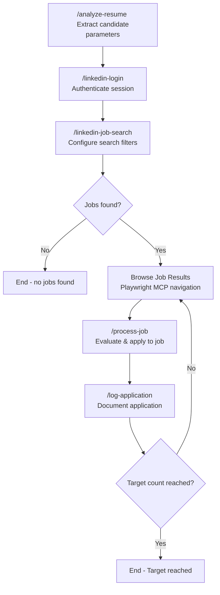

# LinkedIn Job Application Automation

Perform comprehensive LinkedIn job search and application automation with the following parameters:

**Instructions:** 
Parse the following free-text instructions to extract search parameters: $ARGUMENTS

**Default Parameters (if not specified in instructions):**
- Keywords: Extracted from candidate's resume (job titles, skills, seniority level)
- Location: Extracted from candidate's resume (current location, willing to relocate)
- Time Filter: "Past week"
- Target Count: 100 applications

**Resume Analysis:**
The system will automatically analyze the candidate's resume to determine:
- **Job Titles**: Current/target roles (e.g., "Principal Software Engineer", "Staff Engineer")
- **Skills**: Technical expertise for keyword matching (e.g., "AI/ML", "Cloud", "Python")
- **Seniority**: Experience level for appropriate role targeting
- **Location Preferences**: Current location and relocation willingness
- **Industry Focus**: Previous companies/sectors for targeted search

**Example Usage:**
- `/linkedin-jobs` (analyzes resume and uses intelligent defaults)
- `/linkedin-jobs Apply to 20 Staff Software Engineer jobs in California from the past 3 days`
- `/linkedin-jobs Find Principal Engineer positions in Seattle, apply to 50`
- `/linkedin-jobs AI/ML Engineer roles in New York area, target 30 applications this week`
- `/linkedin-jobs Senior Engineer remote positions, apply to 10 jobs posted yesterday`
- `/linkedin-jobs Apply to entry-level and mid-level positions, include overqualified roles`
- `/linkedin-jobs Apply to 30 jobs including positions I'm overqualified for`

**Smart Defaults Example:**
For a resume showing "Principal Software Engineer at Waymo" with "AI/ML, Python, C++" skills in "San Jose, CA", the system would default to searching for "Principal Software Engineer AI/ML" positions in "San Jose, CA" and nearby areas.

**Automation Process Flow:**




**Key Features:**
- Uses Playwright MCP server exclusively for all browser interactions
- Human-like interaction patterns (delays, natural scrolling)
- Comprehensive job matching based on candidate profile
- Automatic resume upload and form completion
- Detailed application tracking and documentation
- Error handling and retry mechanisms
- Skip positions already applied to

**Documentation Format:**
Each application will be documented with:
- Position URL and title
- Company and location details
- Job description and key technologies
- Salary information when available
- Application timestamp and status
- Match reasoning based on qualifications

**Credential Handling:** Managed by `/linkedin-login` slash command with flexible source priority

## Workflow Implementation

**SEQUENTIAL EXECUTION REQUIRED** - All slash commands must run sequentially due to data dependencies:

1. **`/analyze-resume`** → **`/linkedin-login`** (login needs candidate context for user info)
2. **`/linkedin-login`** → **`/linkedin-job-search`** (search needs authenticated session)  
3. **`/linkedin-job-search`** → **Job Browsing** (browsing needs search results loaded)
4. **Job Browsing** → **`/process-job`** (processing needs current job context)
5. **`/process-job`** → **`/log-application`** (logging needs application completion data)

**Direct Playwright MCP Usage:** All browser interactions use `mcp__playwright__browser_*` tools directly for reliable session sharing.

## Slash Command Workflow

**Step 1: Resume Analysis**
```
/analyze-resume [resume-path] [parameters]
- Extract candidate profile and job search parameters
- Cache results for subsequent workflow steps
- Output: Structured candidate profile ready for automation
```
*Command file: `.claude/commands/analyze-resume.md`*

**Step 2: LinkedIn Authentication**
```  
/linkedin-login [credentials]
- Authenticate using .env credentials or interactive prompt
- Establish persistent browser session for job search
- Output: Authenticated LinkedIn session ready for job search
```
*Command file: `.claude/commands/linkedin-login.md`*

**Step 3: Job Search Configuration**
```
/linkedin-job-search [search-parameters]
- Apply candidate-specific filters and keywords
- Configure location, experience, and time filters
- Output: LinkedIn job search results page loaded and ready
```
*Command file: `.claude/commands/linkedin-job-search.md`*

**Step 4: Job Processing Loop**
For each job in search results:
```
# Navigate to job using direct Playwright MCP calls
mcp__playwright__browser_click (job link)

# Process individual job
/process-job [processing-options]
- Evaluate job suitability against candidate profile
- Apply to suitable positions using Easy Apply or external methods
- Output: Application completed or job skipped with reasoning

# Log successful applications  
/log-application [job-details]
- Document application in daily numbered log files
- Track progress toward target application count
- Output: Application logged with sequential number
```
*Command files: `.claude/commands/process-job.md`, `.claude/commands/log-application.md`*

**Step 5: Progress Monitoring**
- Track applications against target count
- Continue job browsing until target reached or jobs exhausted
- Provide final summary of automation results

**Error Handling & Diagnostics:**
- **System Errors**: Invoke diagnostic-fix-agent for Playwright MCP server failures, browser automation errors, or workflow execution crashes
- **Workflow Failures**: Use diagnostic-fix-agent when slash command execution fails repeatedly or automation workflow breaks unexpectedly  
- **Unexpected Behavior**: Call diagnostic-fix-agent for browser session issues, resume analysis errors, or LinkedIn interface changes that break automation

## Implementation

Execute the LinkedIn job application automation workflow using slash commands for reliable MCP session sharing:

**Workflow Execution:**
1. **`/analyze-resume`** - Extract candidate profile with intelligent caching *(.claude/commands/analyze-resume.md)*
2. **`/linkedin-login`** - Establish authenticated browser session *(.claude/commands/linkedin-login.md)*
3. **`/linkedin-job-search`** - Configure search filters and load results *(.claude/commands/linkedin-job-search.md)*
4. **Job Processing Loop** - Browse, evaluate, apply, and log each suitable position *(.claude/commands/process-job.md, .claude/commands/log-application.md)*
5. **Progress Monitoring** - Track applications until target count reached

**Key Advantages of Slash Command Approach:**
- **Direct MCP Access**: No tool isolation issues between agents
- **Session Persistence**: Browser state maintained across all workflow steps
- **Reliable Automation**: Consistent Playwright MCP tool availability
- **Simplified Debugging**: Easier to track and fix workflow issues
- **Better Performance**: Reduced overhead from agent switching

Execute the full LinkedIn job application automation workflow with reliable slash command implementation.