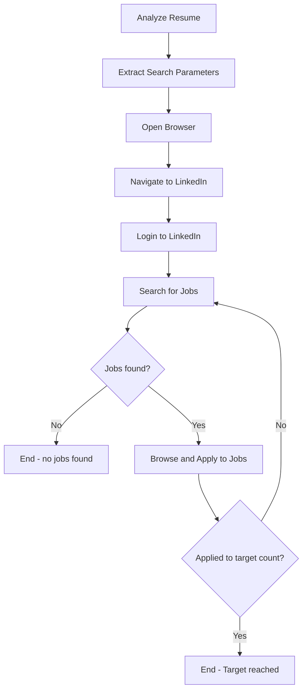

# LinkedIn Job Application Automation

Perform comprehensive LinkedIn job search and application automation with the following parameters:

**Instructions:** 
Parse the following free-text instructions to extract search parameters: $ARGUMENTS

**Default Parameters (if not specified in instructions):**
- Keywords: Extracted from candidate's resume (job titles, skills, seniority level)
- Location: Extracted from candidate's resume (current location, willing to relocate)
- Time Filter: "Past week"
- Target Count: 100 applications

**Resume Analysis:**
The system will automatically analyze the candidate's resume to determine:
- **Job Titles**: Current/target roles (e.g., "Principal Software Engineer", "Staff Engineer")
- **Skills**: Technical expertise for keyword matching (e.g., "AI/ML", "Cloud", "Python")
- **Seniority**: Experience level for appropriate role targeting
- **Location Preferences**: Current location and relocation willingness
- **Industry Focus**: Previous companies/sectors for targeted search

**Example Usage:**
- `/linkedin-jobs` (analyzes resume and uses intelligent defaults)
- `/linkedin-jobs Apply to 20 Staff Software Engineer jobs in California from the past 3 days`
- `/linkedin-jobs Find Principal Engineer positions in Seattle, apply to 50`
- `/linkedin-jobs AI/ML Engineer roles in New York area, target 30 applications this week`
- `/linkedin-jobs Senior Engineer remote positions, apply to 10 jobs posted yesterday`

**Smart Defaults Example:**
For a resume showing "Principal Software Engineer at Waymo" with "AI/ML, Python, C++" skills in "San Jose, CA", the system would default to searching for "Principal Software Engineer AI/ML" positions in "San Jose, CA" and nearby areas.

**Automation Process Flow:**

**Key Features:**
- Human-like interaction patterns (delays, natural scrolling)
- Comprehensive job matching based on candidate profile
- Automatic resume upload and form completion
- Detailed application tracking and documentation
- Error handling and retry mechanisms
- Skip positions already applied to

**Documentation Format:**
Each application will be documented with:
- Position URL and title
- Company and location details
- Job description and key technologies
- Salary information when available
- Application timestamp and status
- Match reasoning based on qualifications

**Credential Priority Order:**
1. **Environment Variables**: Reads from .env file if available (created by `/setup-job-credentials`)
2. **Hardcoded Defaults**: Falls back to built-in defaults if .env not found
3. **Interactive Prompts**: Asks for missing credentials during execution

**Default Credentials (fallback if .env not configured):**
- Email: jobs4alex@allconnectix.com
- Phone: (425)351-1652
- Location: San Jose, CA 95128
- Work Authorization: Green Card holder
- Resume: /Users/alexanderfedin/Library/CloudStorage/OneDrive-Personal/Resumes/AlexanderFedin-AI_2025-01-21.pdf

**Environment Variables Used (from .env):**
- `LINKEDIN_EMAIL` and `LINKEDIN_PASSWORD` for authentication
- `JOB_PHONE`, `JOB_LOCATION`, `JOB_WORK_AUTH` for application forms
- `JOB_RESUME_PATH` for resume upload

**Setup:** Run `/setup-job-credentials` first to configure your .env file for seamless automation.

Execute the full LinkedIn job application automation workflow with the specified search parameters.