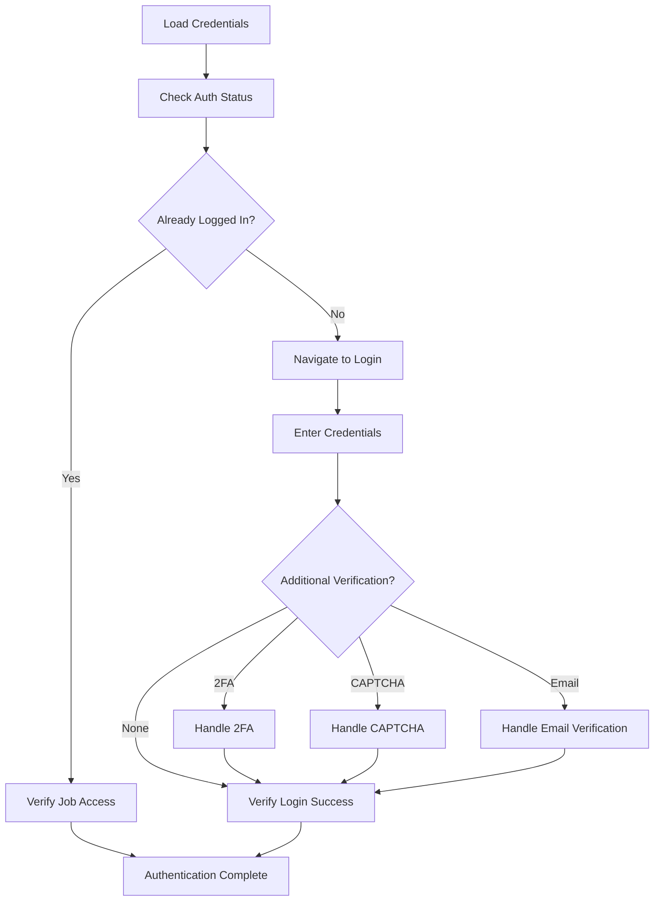

# LinkedIn Authentication

Authenticate to LinkedIn using Playwright browser automation for job search access.

**Instructions:** 
Login to LinkedIn with secure credential handling: $ARGUMENTS

**Default Behavior:**
- **Credential Priority**: Arguments → .env file → interactive prompt
- **Authentication Check**: Verify if already logged in before attempting login
- **Security**: Never expose credentials in logs or outputs
- **Browser Persistence**: Maintain authenticated session for job search workflow

**Authentication Process:**
The system will:
- **Pre-Check**: Assess current LinkedIn authentication status
- **Credential Loading**: Secure retrieval from multiple sources
- **Login Flow**: Navigate LinkedIn's authentication process
- **Verification Handling**: Process 2FA, CAPTCHA, or email verification
- **Access Validation**: Confirm job search functionality is available

**Credential Sources:**
1. **Command Arguments** - Direct credential specification (highest priority)
2. **Environment Variables** - `.env` file with LINKEDIN_EMAIL and LINKEDIN_PASSWORD
3. **Interactive Prompt** - Secure credential entry when needed

**Authentication States:**
- **✅ Fully Authenticated** - Complete access to all LinkedIn features
- **⚠️ Partially Authenticated** - Login successful, requires additional verification
- **❌ Authentication Failed** - Unable to authenticate with provided credentials
- **🔍 Already Authenticated** - User already logged in, ready for job search

**Example Usage:**
- `/linkedin-login` (uses .env credentials and checks current auth status)
- `/linkedin-login --email user@example.com --password mypassword`
- `/linkedin-login --check-only` (only verify authentication status)
- `/linkedin-login --force-login` (logout and re-login even if authenticated)

**Multi-Step Authentication Flow:**

**Security Features:**
- **Credential Protection**: Never log or expose passwords
- **Session Security**: Proper cookie and token handling
- **Error Handling**: Secure failure reporting without credential disclosure
- **Manual Override**: Support for manual login when automated flow fails

**Browser Integration:**
- **Playwright MCP**: Direct browser automation using `mcp__playwright__browser_*` tools
- **Natural Interaction**: Human-like delays and interaction patterns
- **State Management**: Maintain browser session across workflow steps
- **Error Recovery**: Robust handling of UI changes and network issues

**Verification Steps:**
After successful authentication, the system verifies:
- Access to LinkedIn job search page
- User profile and dashboard availability
- Job application functionality status
- Session persistence and stability

**Error Scenarios:**
- **Invalid Credentials**: Clear error message with retry options
- **Account Locked**: Guidance for account recovery
- **2FA Required**: Step-by-step verification assistance  
- **Network Issues**: Retry logic with exponential backoff
- **Interface Changes**: Fallback strategies for UI updates

**Output Context:**
Provides authentication status and session information for downstream job search and application processes.

## Implementation

**Step 1: Credential Resolution**
- Check command arguments for email/password
- Fall back to .env LINKEDIN_EMAIL and LINKEDIN_PASSWORD
- Prompt interactively if credentials unavailable
- Validate credential format and availability

**Step 2: Authentication Assessment**
- Use Playwright to navigate to LinkedIn
- Check for existing authentication state
- Verify access to job search functionality
- Determine if login is actually required

**Step 3: Login Process (if needed)**
- Navigate to LinkedIn login page
- Enter credentials using secure form filling
- Handle dynamic login flow elements
- Monitor for authentication success indicators

**Step 4: Verification Handling**
- Detect 2FA, CAPTCHA, or email verification requirements
- Provide user guidance for manual completion
- Wait for verification completion
- Validate authentication after verification

**Step 5: Access Validation**
- Navigate to job search page to confirm access
- Verify user profile and dashboard availability
- Check job application functionality status
- Confirm session stability and persistence

**Step 6: Session Preparation**
- Ensure browser state ready for job search
- Configure session for optimal automation performance
- Prepare context for downstream workflow steps
- Document authentication status and capabilities

Execute secure LinkedIn authentication with comprehensive verification and error handling.