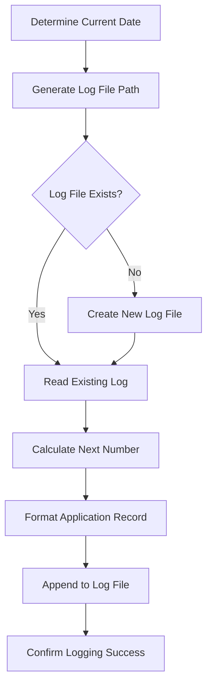

# Application Logging and Documentation

Log job application details to daily numbered listicle files for comprehensive tracking.

**Instructions:** 
Document job application with complete details: $ARGUMENTS

**Default Behavior:**
- **Daily Log Files**: Store in `.claude/applications/logs/` with date-based filenames
- **Sequential Numbering**: Maintain continuous numbering within each day
- **Structured Format**: Consistent markdown listicle format for all applications
- **Complete Information**: Capture all available job and application details

**Logging Process:**
The system will:
- **Date Determination**: Calculate today's date for correct log file targeting
- **File Management**: Create daily log file if it doesn't exist
- **Number Calculation**: Generate next sequential number for new entry
- **Record Creation**: Format comprehensive application record
- **File Append**: Add structured record to today's log file

**Log File Structure:**
- **Directory**: `.claude/applications/logs/`
- **Naming**: `YYYY-MM-DD.md` (e.g., `2025-09-07.md`)
- **Format**: Numbered markdown listicles with structured job information
- **Continuity**: Sequential numbering per day, starting at 1 each day

**Application Record Details:**
- **Position Title**: Name/title of the job position
- **Company Name**: Employing organization
- **Job Description**: Role responsibilities and requirements summary
- **Compensation**: Salary, benefits, equity details (when available)
- **Location**: Work arrangement (remote/hybrid/onsite) and geographic location
- **Position Posted**: When job was originally published (if available)
- **Application Time**: When application was submitted
- **Job Relevance**: Match level (High/Medium/Low) with candidate profile
- **Application Reasoning**: Brief explanation for application decision

**Example Usage:**
- `/log-application --title "Principal Engineer" --company "Google" --relevance High`
- `/log-application --job-data "$(cat current_job.json)" --applied-at "2025-09-07T10:30:00Z"`
- `/log-application --position "Staff SWE" --location "Remote" --salary "200k-300k"`

**Record Format Example:**
```markdown
## 1. Principal Software Engineer at Google
- **Company**: Google
- **Location**: Mountain View, CA (Hybrid)
- **Job Description**: Lead engineering teams developing large-scale distributed systems...
- **Compensation**: $180,000 - $280,000 + equity + benefits
- **Position Posted**: 2025-09-06
- **Application Time**: 2025-09-07 10:30 AM PST
- **Job Relevance**: High - Strong match for AI/ML expertise and senior engineering experience
- **Application Reasoning**: Perfect fit for distributed systems background and leadership experience
```

**Multi-Step Logging Process:**



**Data Validation:**
- **Required Fields**: Position title and company name (minimum)
- **Optional Fields**: Graceful handling of missing information
- **Format Consistency**: Standardized structure across all entries
- **Information Accuracy**: Verify all provided details before logging

**File Management:**
- **Directory Creation**: Ensure `.claude/applications/logs/` exists
- **File Permissions**: Proper read/write access for log files
- **Backup Strategy**: Maintain log file integrity and prevent data loss
- **Storage Efficiency**: Organized structure for easy search and analysis

**Sequential Numbering:**
- **Daily Reset**: Start at 1 for each new day
- **Continuous Sequence**: No gaps in numbering within a day
- **Conflict Resolution**: Handle concurrent logging attempts
- **Number Validation**: Verify sequential integrity

**Error Handling:**
- **File System Issues**: Create directories and files as needed
- **Permission Problems**: Clear error messages with resolution guidance
- **Data Integrity**: Validate all information before writing
- **Recovery Strategies**: Backup and restore capabilities for corrupted logs

**Quality Assurance:**
- **Complete Records**: Ensure all available information is captured
- **Consistent Formatting**: Maintain standardized record structure
- **Accurate Timestamps**: Proper date and time recording
- **Professional Documentation**: Clear, comprehensive application records

**Output Context:**
Provides logging confirmation and application tracking information for workflow monitoring.

## Implementation

**Step 1: Date and File Path Determination**
- Calculate current date in YYYY-MM-DD format
- Generate log file path: `.claude/applications/logs/YYYY-MM-DD.md`
- Create directory structure if it doesn't exist
- Verify file permissions and accessibility

**Step 2: Sequential Number Calculation**
- Read existing log file content if it exists
- Parse existing numbered entries to find highest number
- Calculate next sequential number (highest + 1, or 1 for new files)
- Validate numbering sequence integrity

**Step 3: Application Record Formatting**
- Structure job information in standardized listicle format
- Include all available details with clear field labels
- Handle missing information with "Not specified" placeholders
- Ensure consistent markdown formatting

**Step 4: File Operations**
- Create new log file with header if it doesn't exist
- Append formatted application record to existing log file
- Maintain proper markdown structure and formatting
- Verify write operation success

**Step 5: Logging Confirmation**
- Confirm record was added with correct sequential number
- Provide log file path and entry details
- Update application tracking metrics
- Return success status with complete information

Execute comprehensive application logging with structured documentation and sequential tracking.