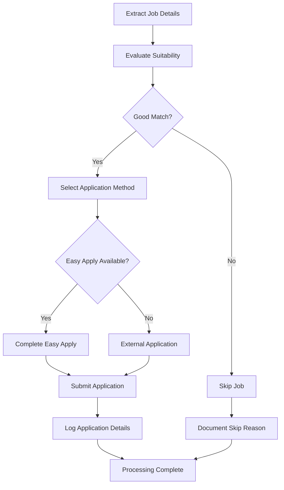

# LinkedIn Job Processing and Application

Process individual LinkedIn job posting through evaluation and application workflow.

**Instructions:** 
Process currently displayed LinkedIn job posting: $ARGUMENTS

**Critical Constraint:** 
Work exclusively on the job posting currently displayed in the browser. Do not navigate to other jobs or search for different positions.

**Processing Workflow:**
The system will:
- **Extract Details**: Analyze current job posting content and requirements
- **Evaluate Suitability**: Assess match against candidate profile and preferences  
- **Make Decision**: Apply to suitable positions, skip inappropriate ones
- **Execute Application**: Complete application using optimal method (Easy Apply preferred)
- **Document Results**: Log application details for tracking and analysis

**Evaluation Criteria:**
- **Role Alignment**: Position title and responsibilities match candidate background
- **Company Fit**: Reputation, culture, and industry alignment with preferences
- **Location Match**: Remote, hybrid, on-site compatibility with candidate preferences
- **Compensation**: Salary range alignment with candidate expectations
- **Skills Match**: Required technical skills align with candidate expertise
- **Experience Level**: Appropriate seniority level for candidate background

**Overqualified Position Policy:**
- **Default**: Skip positions where candidate is significantly overqualified
- **User Override**: Apply to overqualified positions when explicitly requested
- **Documentation**: Mark overqualified applications as "Medium" relevance with reasoning

**Application Methods:**
1. **LinkedIn Easy Apply** (preferred for speed and convenience)
2. **External Company Portal** (when Easy Apply unavailable)
3. **Direct Company Website** (for specific application requirements)
4. **Email Application** (when other methods not available)

**Example Usage:**
- `/process-job` (evaluate and apply to current job posting)
- `/process-job --skip-overqualified false` (apply even if overqualified)
- `/process-job --easy-apply-only` (only apply if Easy Apply available)
- `/process-job --dry-run` (evaluate without applying)

**Multi-Step Processing Flow:**

**Job Detail Extraction:**
- **Basic Info**: Position title, company name, location, posting date
- **Job Description**: Role responsibilities, requirements, qualifications
- **Compensation**: Salary range, equity, benefits information (when available)
- **Work Arrangement**: Remote, hybrid, on-site requirements
- **Company Details**: Industry, size, culture information
- **Application Method**: Easy Apply, external portal, direct application

**Suitability Assessment:**
- **Skills Alignment**: Technical requirements vs candidate capabilities
- **Experience Match**: Required years vs candidate background
- **Location Compatibility**: Work arrangement vs candidate preferences
- **Career Growth**: Role progression and development opportunities
- **Company Culture**: Values alignment and work environment fit
- **Compensation Fit**: Salary expectations vs offered range

**Application Execution:**
- **Form Completion**: Automated filling of application forms
- **Resume Upload**: Attach candidate resume file
- **Cover Letter**: Generate or use template when required
- **Additional Questions**: Answer screening questions intelligently
- **Review and Submit**: Final validation before application submission

**Application Logging:**
After successful application, document:
- **Job Information**: Title, company, description, requirements
- **Location Details**: Remote/hybrid/onsite, geographic location  
- **Compensation**: Salary range, equity details (if available)
- **Timestamps**: Job posting date, application submission time
- **Relevance Score**: High/Medium/Low match with reasoning
- **Application Method**: Easy Apply, external portal, etc.

**Error Handling:**
- **Form Issues**: Fallback strategies for dynamic forms
- **Upload Problems**: Resume attachment error recovery
- **Network Errors**: Retry logic with exponential backoff
- **External Redirects**: Handle company portal transitions
- **Session Timeouts**: Re-authentication when needed

**Quality Assurance:**
- **Application Review**: Validate all fields before submission
- **Duplicate Prevention**: Check if already applied to position
- **Data Accuracy**: Ensure contact information and details are correct
- **Professional Standards**: Maintain high-quality application standards

**Output Context:**
Provides processing outcome and application details for workflow tracking.

## Implementation

**Step 1: Job Detail Extraction**
- Use Playwright to extract job posting content from current browser page
- Parse job title, company name, location, and posting date
- Extract job description, requirements, and qualifications
- Identify compensation information when available
- Determine available application methods

**Step 2: Suitability Assessment**  
- Compare job requirements against candidate profile
- Evaluate skills match and experience level alignment
- Assess location and work arrangement compatibility
- Check compensation alignment with candidate expectations
- Apply overqualified position policy based on user preferences

**Step 3: Application Decision**
- Make apply/skip decision based on suitability assessment
- Consider application method availability and preferences
- Factor in user instructions for overqualified positions
- Document decision reasoning for transparency

**Step 4: Application Method Selection**
- Prefer LinkedIn Easy Apply when available
- Handle external company portals when necessary
- Support direct website applications when required
- Manage email-based application processes

**Step 5: Application Form Completion**
- Automate form field completion with candidate information
- Upload resume file using secure file handling
- Generate cover letter content when required
- Answer screening questions based on candidate profile

**Step 6: Application Submission and Logging**
- Review and submit application with validation
- Confirm successful submission and capture confirmation
- Log complete application details with relevance scoring
- Update application progress tracking

Execute comprehensive job processing with intelligent evaluation and professional application submission.